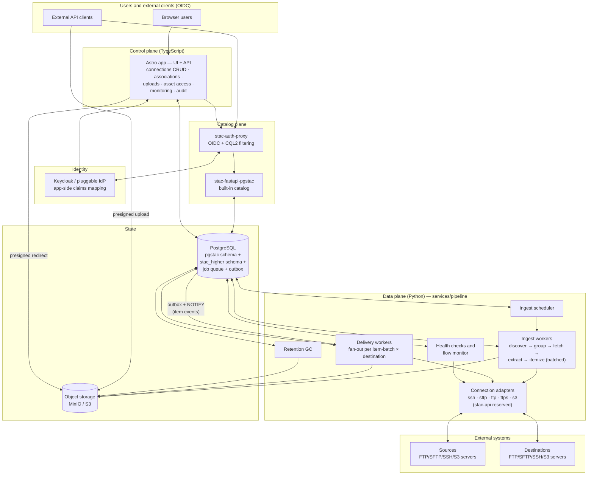
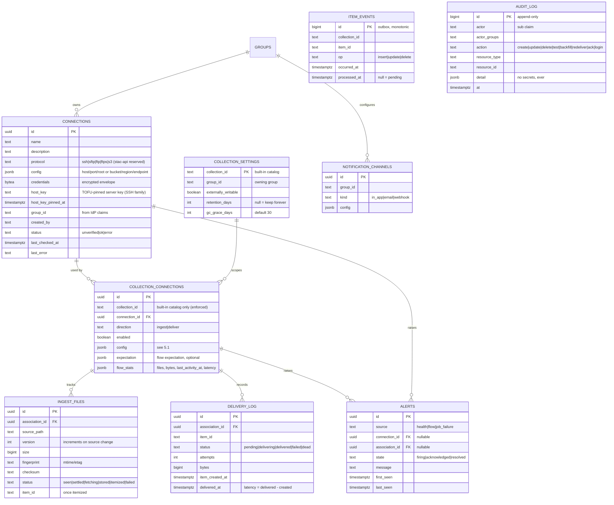
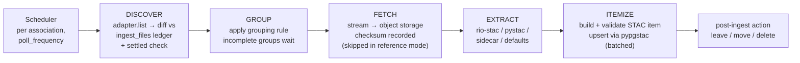
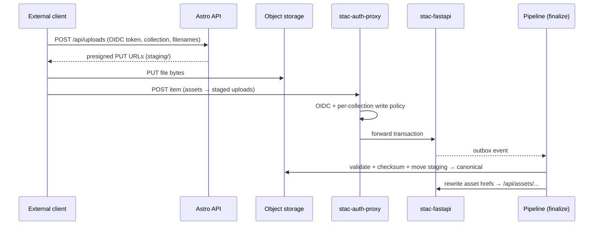
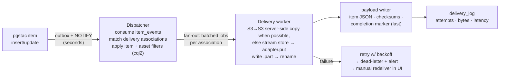

# ROADMAP — Ingest · Catalog · Disseminate Platform

STAC Higher grows from a STAC client into an enterprise platform for **ingesting,
cataloging, and disseminating geospatial products**: files arrive through
connections, become STAC items in a built-in catalog with platform-owned object
storage, and are pushed out through delivery connections in near real time — at
Earth-Search-class scale, for gov/defense-adjacent deployments.

This document is the long-term plan: locked decisions, target architecture,
data model, flows, and a phased implementation roadmap. Each phase is designed
to be implemented over 1–3 working sessions and to be independently shippable.

---

## 1. Locked decisions

| Topic | Decision |
|---|---|
| Deployment model | Enterprise, multi-user. Cloud-portable; AWS first (GovCloud-compatible). Local dev stays a single `docker compose up`. Not air-gapped — AWS managed services are available where the deployment allows. |
| Compliance posture | Gov/defense-adjacent; FISMA High is the eventual operating environment. Consequences are first-class, not bolt-ons: audit logging from Phase 1, KMS-encrypted credentials, host-key pinning, documented network-policy requirements. |
| Scale envelope | Earth-Search class: **100k+ items/day sustained**, million-item backfills, assets 100 MB–multi-GB, and **most items delivered** to at least one destination. Supported honestly: FTP/SFTP endpoints carry NRT-subset volumes; full-envelope volume assumes object storage on at least one side of every flow. A load-test gate precedes any production scale claim (Phase 8). |
| Identity | OIDC with a pluggable IdP. Keycloak ships in docker-compose as the default; Cognito/Entra/Okta swappable per deployment. An **app-side claims-mapping layer** (per-deployment config mapping arbitrary claim paths → canonical `groups`/`roles`) is the compatibility contract — IdPs are not required to emit our token shape. |
| Access control | Connections are **group-owned**. Roles: `member` (view group connections, associate them), `operator` (create/edit/operate connections), `admin` (cross-group everything). |
| Catalog scope | Ingest/delivery associations attach to **built-in-catalog collections only** (enforced in the API). External catalogs stay browse-only in the client. A `stac-api` connection protocol (harvest another STAC API, CQL2-filtered) is a reserved future protocol — the adapter model must not foreclose it. |
| Ingest semantics | Configurable per collection↔connection association: file patterns, grouping rules, metadata strategy, poll frequency, and **storage mode** (`copy` default, `reference` for high-volume object-store sources). A source file that changes after itemization is a **new version of the same product**: re-fetch, replace asset, upsert same item id. |
| Delivery semantics | **Assets only**, laid out at the destination by a configurable path template, with a **configurable payload** per association (bare files / + STAC item JSON / + checksums / + completion marker). Event-driven, target latency in **single-digit seconds** plus transfer time. Item updates honor a per-association `on_update: redeliver \| ignore` knob. **Deletions never propagate** — destination drift is accepted. |
| Object storage | Ingested bytes are copied into platform-owned S3-compatible storage (MinIO locally, S3 on AWS) **by default**. `reference` mode catalogs items whose assets stay at the source. Either way, asset hrefs point at our asset service, never directly at storage or sources. |
| Retention | Per-collection **retention period**: when an item's age exceeds it, the item is removed from the catalog and its assets from object storage via async GC with a configurable grace window. Rolling-archive semantics; at envelope scale, deletion is a bulk code path. |
| Pipeline runtime | **Python** (`services/pipeline`): rio-stac/pystac/stac-pydantic for metadata + validation (stactools core is unmaintained — not a dependency); fsspec/paramiko/ftplib for protocol adapters, obstore for object-store I/O. |
| Topology | Modular monolith pipeline service. Postgres is system of record; the **job queue sits behind an interface with per-deployment backends**: Procrastinate (LISTEN/NOTIFY, default, zero added infra) or SQS (AWS deployments). Jobs are **batch-oriented** (one job = N files/items) so job rate stays low at envelope scale. Seams kept clean so modules can split into services when load demands. |
| Eventing | pgstac item changes → vendored statement-level trigger writing a **durable outbox table** (`item_events`), with NOTIFY as a wake-up signal only — never the payload channel. Catches items from *every* write path, survives dispatcher restarts, and sidesteps the 8 KB `pg_notify` cap that bulk upserts would blow through. |
| eoAPI alignment | Reuse the eoAPI ecosystem wherever it fits (see §4) rather than building parallel infrastructure. |

---

## 2. Scale & compliance envelope

The two answers that shape everything else:

**Byte volume is the binding constraint.** 100k+ full-size scenes/day with most
items delivered means **tens to hundreds of TB/day** through the platform if
every byte is copied in and pushed out. The design absorbs this three ways:

1. **`storage_mode: reference`** per ingest association — high-volume
   object-store sources are cataloged in place; the asset service still fronts
   every href (RBAC check → redirect to source), so catalog links stay uniform.
2. **S3→S3 server-side copy** on the delivery path — when source-or-canonical
   and destination are both object storage, bytes never stream through our
   workers.
3. **Honest protocol claims** — FTP/SFTP sources and destinations are
   supported at NRT-subset volumes (the ground-segment trickle), not at full
   envelope volume. The envelope assumes object storage on at least one side.

**FISMA High is the destination.** Not air-gapped — AWS (GovCloud) services are
in scope — but the control surface must be auditable from day one: append-only
audit log (Phase 1), KMS envelope encryption, TOFU-pinned host keys, deny-private
egress in code *plus* documented network policy, write-only credentials. A
formal control-mapping pass (FedRAMP High baseline) is an explicit pre-production
work item, tracked in §10.

---

## 3. Target architecture



**Plane separation (the load-bearing idea):**

- **Control plane — Astro app (TS).** All CRUD, permission checks, upload
  brokering, monitoring UI, audit-log writes. Never opens SSH/FTP sessions,
  never holds decrypted credentials.
- **Catalog plane — stac-auth-proxy + stac-fastapi-pgstac.** The built-in
  catalog, pre-seeded and undeletable in the client's catalog list.
  stac-auth-proxy enforces catalog read visibility and per-collection write
  rights from OIDC claims (CQL2 filters / OPA policy).
- **Data plane — pipeline service (Python).** The only component that decrypts
  credentials and moves bytes. Five modules behind one process initially:
  ingest scheduler, ingest workers, delivery workers, retention GC, health/flow
  monitor. All protocol access goes through one adapter interface:
  `list / get / put / delete / test`.
- **Postgres as spine.** One instance, four concerns: pgstac (catalog),
  `stac_higher` (platform entities), job queue, `item_events` outbox. The
  queue is an interface with two backends — Procrastinate for local/modest
  deployments, SQS for AWS — chosen per deployment, invisible to business
  logic. Batch-oriented jobs keep the job rate within Postgres-queue limits
  even at envelope scale.
- **Asset access.** Item asset hrefs point at
  `/api/assets/{collection}/{item}/{asset}` → RBAC check → 302 to a
  short-lived presigned object-store URL (canonical storage) or to the source
  (`reference` mode). Catalog links stay stable even if storage moves; storage
  is never exposed directly.

---

## 4. Reuse from the ecosystem

We are already on eoAPI's foundation (pgstac + stac-fastapi-pgstac). Adopt the
rest of the ecosystem where it fits — with eyes open about maturity:

| Project | Role here | Mode |
|---|---|---|
| [stac-auth-proxy](https://github.com/developmentseed/stac-auth-proxy) | OIDC auth + CQL2 content filtering in front of the built-in catalog; per-collection write policies (CQL2 transaction filtering, OPA available) | Adopt — transaction filtering is v1.0-era (Feb 2026); integration-test the write paths, don't assume them |
| [pypgstac](https://github.com/stac-utils/pgstac) | Bulk item upserts from ingest workers | Library |
| [rustac](https://github.com/stac-utils/rustac) | Bulk operations: backfills, exports, stac-geoparquet I/O | Evaluate in Phase 4; adopt for backfills if pypgstac alone can't hold the envelope |
| [rio-stac](https://github.com/developmentseed/rio-stac) + [pystac](https://github.com/stac-utils/pystac) | Metadata extraction (geometry, datetime, proj/raster extensions) in the EXTRACT stage | Library — **stactools core is unmaintained and is not a dependency**; individual `stactools-packages` may be vendored case-by-case |
| [stac-pydantic](https://github.com/stac-utils/stac-pydantic) + [stac-validator](https://github.com/stac-utils/stac-validator) | Validation gates: ITEMIZE output, push-ingest finalize, import QA | Library |
| [stac-asset](https://github.com/stac-utils/stac-asset) | Read half of delivery workers (multi-auth asset fetch) | Evaluate in Phase 5 |
| [obstore](https://github.com/developmentseed/obstore) | Object-store I/O in workers (much faster than fsspec/boto3 for many objects) | Library |
| [cql2-rs](https://github.com/developmentseed/cql2-rs) (Python bindings) | Evaluating delivery `item_filter` expressions in the dispatcher | Library |
| [eoapi-notifier](https://github.com/developmentseed/eoapi-notifier) / eoapi-k8s trigger SQL | **Pattern source only.** The NOTIFY trigger is a custom SQL file in eoapi-k8s, not a pgstac feature; raw NOTIFY is at-most-once with an 8 KB payload cap. We vendor the trigger pattern into a durable outbox (§5.4) instead. Watch pgstac's incoming `items_deleted_log`/`pgstac_updated_at` change-feed primitives — they may replace the vendored trigger. | Vendor pattern |
| [titiler-pgstac](https://github.com/stac-utils/titiler-pgstac) | Dynamic raster tiles for map previews of ingested imagery | Adopt in Phase 8 (stretch) |
| [eoapi-cdk](https://github.com/developmentseed/eoapi-cdk) / [eoapi-k8s](https://github.com/developmentseed/eoapi-k8s) | AWS/K8s deployment of the catalog-plane slice; extended with our app, pipeline, and storage | Adopt in Phase 8 |
| [stac-manager](https://github.com/developmentseed/stac-manager) | Dev Seed's OIDC STAC-CRUD admin UI — overlaps our curation UI | Watch for form-builder/plugin patterns; not adopted |

**Prior art worth mining, not adopting:** NASA **Cumulus** validates the
provider/connection model (its provider schema and "settled file" semantics are
the reference for §6.1); **Planet's Destinations API** is the design template
for the delivery tier (validated, encrypted, org-shared destination objects +
test-probe on creation). Nothing open-source or commercial covers STAC-keyed
push delivery to FTP/SFTP with path templates — that tier is greenfield.

Not adopted: eoAPI's Lambda ingestor API as-is — our push-ingest (Phase 7)
reuses its *pattern* (authenticated ingest + validation) on our storage and
RBAC instead.

---

## 5. Data model

New tables live in the existing `stac_higher` schema alongside `extensions`.
Migrations continue to run via the existing middleware mechanism (revisit in
Phase 0 if the pipeline service also needs migration authority).



At envelope scale, `ingest_files`, `item_events`, `delivery_log`, and
`audit_log` are high-volume tables: time-partitioned from the start, each with
its own retention/cleanup job. `audit_log` retention is compliance-driven and
configured per deployment, never silently truncated.

### 5.1 Association `config` shapes

**Ingest** (`direction = 'ingest'`):

```jsonc
{
  "source_path": "/outgoing/products",
  "include": ["**/*.tif", "**/*.xml"],
  "exclude": ["**/*.tmp"],
  "poll_frequency_seconds": 300,
  "storage_mode": "copy",  // copy (default) | reference (assets stay at source; object-store sources only)
  "grouping": { "rule": "shared_basename", "timeout_seconds": 900, "on_timeout": "ingest_partial" },
  "metadata": { "strategy": "raster_auto", "sidecar": { "pattern": "{basename}.xml", "parser": "generic_xml" }, "defaults": { "datetime": "file_mtime" } },
  "post_ingest": "leave"   // leave | move:<path> | delete
}
```

**Delivery** (`direction = 'deliver'`):

```jsonc
{
  "path_template": "{collection}/{yyyy}/{mm}/{dd}/{item_id}/{filename}",
  "item_filter": null,               // optional CQL2 subset (evaluated via cql2 bindings)
  "asset_keys": null,                // null = all assets
  "payload": {                       // what lands beside the assets — all optional
    "item_json": true,               // STAC item JSON sidecar
    "checksums": "sha256",           // per-file sidecars: null | md5 | sha256
    "completion_marker": true        // manifest written LAST — multi-file products are complete when it appears
  },
  "on_update": "redeliver",          // redeliver (changed-checksum assets only) | ignore
  "overwrite": "if_newer",           // never | always | if_newer — if_newer is the sane default with on_update: redeliver
  "retry": { "max_attempts": 5, "backoff": "exponential" },
  "max_concurrent_transfers": 4      // per-connection concurrency cap
}
```

Deletions never propagate to destinations: delivered files are the consumer's
copy, and drift is accepted by design.

**Expectation** (optional, either direction):

```jsonc
{ "expect_activity_within_seconds": 3600 }          // ingest: data must flow
{ "deliver_within_seconds": 30 }                    // delivery: NRT SLO
```

### 5.2 Credentials & host keys

- Write-only through the API: never returned after creation, UI shows
  metadata only ("SSH key set", "secret key ····").
- Encrypted envelope at rest: AES-256-GCM under a master key from env/secrets
  locally; AWS KMS envelope encryption in cloud deployments. The encryption
  provider is an interface so the two coexist.
- Decryption happens only inside the pipeline service, at job execution time.
- **Server authentication (SSH family): TOFU with pinning.** The host key is
  captured on the first successful "Test connection", stored on the
  connection row, and any later mismatch hard-fails the job and flips the
  connection to `error` with an explicit re-verify action in the UI.

### 5.3 Object storage layout

```
{bucket}/
  assets/{collection}/{item_id}/{filename}     # canonical
  staging/{upload_id}/{filename}               # push-ingest uploads, TTL-cleaned
```

### 5.4 Event outbox

The pgstac trigger (vendored from the eoapi-k8s pattern, rewritten) is a
statement-level AFTER trigger with transition tables that **inserts one row
per item into `item_events`** — never a `pg_notify` payload, which caps at
~8 KB and would abort bulk-upsert transactions. A separate `pg_notify` (no
payload) wakes the dispatcher; on wake *or* on a poll interval, the dispatcher
consumes pending outbox rows in order. Restarts lose nothing; bulk loads of
any size are safe. When pgstac ships `items_deleted_log`/`pgstac_updated_at`
(in its unreleased changelog), re-evaluate whether the vendored trigger can be
replaced by polling pgstac's own change feed. Pin the pgstac version and
upgrade-test the trigger path — pgstac's internal trigger machinery is being
restructured upstream.

### 5.5 Security boundaries

- **Adapter egress policy (both layers):** the adapter layer refuses
  private/loopback/link-local targets by default (the pipeline analog of the
  app's `safeFetch`), with a per-deployment allowlist env for legitimately
  internal sources; *and* deployment docs specify the network policy
  (security groups / K8s NetworkPolicy) that constrains pipeline egress in
  hardened environments. An operator must not be able to point a "connection"
  at RDS, metadata endpoints, or MinIO admin.
- **Claims mapping:** a per-deployment config maps IdP claim paths to the
  canonical `groups`/`roles` model (e.g. `cognito:groups` → groups, Entra
  group GUIDs → names). The app trusts only the mapped output.
- **Audit:** every mutation, credential lifecycle event, test-connection,
  backfill, redeliver, and login lands in `audit_log` (append-only, no
  secrets in `detail`).

---

## 6. Flows

### 6.1 Ingest A — poll-based (connections)



- **Jobs are batch-oriented:** one job carries N files/items (per stage, per
  association), so 100k items/day stays at single-digit jobs/sec regardless
  of queue backend. Backfills run as chunked bulk jobs (pypgstac/rustac),
  never per-item fan-out.
- Every stage is idempotent against the `ingest_files` ledger — re-runs never
  double-ingest.
- **Settled check:** a file must be unchanged (size/fingerprint) across two
  polls before it is eligible — FTP/SFTP sources are frequently mid-upload.
- **Re-ingest:** a fingerprint change on an already-itemized file is a new
  version of the same product — re-fetch, replace the asset in canonical
  storage, upsert the same `item_id` (ledger `version` increments). The
  update flows to delivery per each association's `on_update` policy.
- ITEMIZE validates via stac-pydantic (+ stac-validator on demand) before
  upsert.
- Asset hrefs in the created item point at `/api/assets/...` in both storage
  modes.

### 6.2 Ingest B — push via API (direct interaction)

For collections flagged **externally writable**:



### 6.3 Ingest C — manual (UI)

Item create/edit forms gain asset upload using the same presigned-upload path
as flow B, driven by our frontend.

### 6.4 Delivery (NRT)



- **Isolation:** work is partitioned per destination — a slow FTP server never
  blocks another destination.
- **Transfer paths:** when both ends are object storage, use server-side copy
  (no bytes through workers); FTP/SFTP destinations stream, capped by
  `max_concurrent_transfers` — the primary NRT tuning knob.
- **Atomic visibility:** per-file `.part` → rename; for multi-file products,
  the completion marker (when enabled) is written last and is the "product is
  complete" signal for directory-watching consumers.
- **Updates:** `on_update: redeliver` pushes only assets whose checksums
  changed, honoring the overwrite policy. `ignore` makes delivery
  fire-once-per-item.
- **Deletes:** never propagated.
- **Late-added associations** apply to new items only; "backfill existing
  items" is an explicit, user-initiated action running as chunked bulk jobs.
- **Finalize gating:** for externally-writable collections, the insert event
  arrives while assets are still in staging — the dispatcher defers those
  items until the finalize step (§6.2) marks them ready, so delivery always
  streams from canonical storage and never double-fires on the href rewrite.

### 6.5 Retention & GC

- `collection_settings.retention_days` defines a rolling window per
  collection (`null` = keep forever).
- A scheduled GC job selects expired items in bulk, deletes them from pgstac
  (which emits `delete` outbox events for bookkeeping — deletions do not
  propagate to destinations), and marks their canonical assets for removal.
- Asset removal happens after `gc_grace_days` (default 30) — recoverable from
  oops-deletes; storage never leaks. Ledger and log rows age out on their own
  partition-drop schedules.
- Manual item/collection deletion follows the same marked-then-collected path.

### 6.6 Observability

- **Connection health:** scheduled lightweight checks (connect + list) update
  `status` / `last_checked_at` / `last_error`; real job failures feed the same
  status. Surfaced as badges on `/connections`.
- **Flow monitoring:** associations accumulate `flow_stats`; a monitor job
  evaluates declared expectations (§5.1) and raises alerts on violation.
  Absence-of-data is only detectable against a declared expectation — an
  empty poll may be normal.
- **Alerts:** `alerts` rows (firing → acknowledged → resolved) with
  dedup/re-fire on `last_seen`. Notification channels per group: in-app
  first; email + webhook later.
- **Service telemetry:** Prometheus `/metrics` + structured JSON logs from
  day one; OpenTelemetry traces as later hardening.

---

## 7. Access control

Identity, groups, and role membership live in the IdP; the claims-mapping
layer (§5.5) normalizes them. The app maps canonical claims to capabilities;
`stac_higher` stores only resource↔group ownership.

| Capability | member | operator | admin |
|---|:-:|:-:|:-:|
| See group's connections (no credentials) | ✓ | ✓ | ✓ (all groups) |
| Associate connections ↔ collections | ✓ | ✓ | ✓ |
| Create / edit / delete connections | | ✓ | ✓ |
| Enable/disable flows, backfill, redeliver | | ✓ | ✓ |
| Manage collection exposure (visibility, externally-writable, retention) | | ✓ | ✓ |
| View audit log (own group / all) | | ✓ | ✓ |
| Manage groups, platform settings, see everything | | | ✓ |

Enforcement by plane:

- **Astro API** — connections, associations, uploads, asset access,
  monitoring, audit.
- **stac-auth-proxy** — catalog reads (collection visibility as CQL2 filters
  derived from group claims) and writes (per-collection POST/PUT/DELETE
  policy). OPA integration available when policies outgrow static mapping.

---

## 8. UI surface

| Page | Contents |
|---|---|
| `/connections` | List + live health badges; per-protocol create/edit wizard (SSH-family: host/port/user/key; S3: bucket/region/endpoint/keys); Test connection; host-key re-verify action on mismatch |
| Collection **Data flow** tab | Associate connections; ingest config (patterns, grouping, metadata, poll frequency, storage mode); delivery config (path template, filters, payload options, on_update, expectations); enable/disable; backfill/redeliver |
| Collection **Settings** | Group ownership, visibility, externally-writable flag, retention period |
| `/monitoring` | Flow timelines per association, delivery latency, alert list with ack/resolve; alert bell in header |
| `/admin` | Groups, cross-group connections/collections overview, audit-log viewer |
| Item forms | Asset upload via presigned flow |

All new UI follows the existing conventions: Astro thin shells + React
islands, TanStack Query for server state, shared components in
`packages/shared` where reusable.

---

## 9. Phases

Dependency chain: `0 → 1 → 2 → 3 → 4 → 5 → 6 → 7 → 8`, though 6 and 7 can
swap, and 8's IaC work can start in parallel any time after 2.

**Implementation status — 2026-07-16** (legend: ✅ done · 🚧 in progress · ⬜ not started):

| Phase | Status | Notes |
|---|---|---|
| 0 — Foundations | ✅ Done | Merged to `ai/main`, full stack verified live (`docker compose up`, heartbeat through the queue, client on the built-in catalog). |
| 1 — Auth, RBAC & audit | ✅ Done | Merged & verified. One item carried forward: per-collection **read-visibility** filtering at the proxy needs OPA / a custom filter factory (ADR 0002) — transaction protection + audience validation are done and integration-tested. |
| 2 — Connections | ✅ Done | Merged to `ai/main` (app CRUD + AES-256-GCM credential envelope + RBAC/audit, pipeline adapters s3/sftp/ftp/ftps, egress SSRF policy + IP-pinning, TOFU host-key pinning, drain + health-sweep jobs, `/connections` UI). Live-verified end-to-end: SFTP/FTP/S3 test-connections, egress block of the metadata IP, and a TOFU host-key-mismatch catch. FTPS live-tested only on amd64 (test-server image caveat); shares the FTP adapter path + unit-tested. |
| 3 — Object storage & asset service | ✅ Done | App storage lib + `GET /api/assets/{collection}/{item}/{asset}` (RBAC → presigned 302) + `POST /api/uploads` (operator+, presigned PUT) + manual asset upload in the item form + pipeline staging-TTL cleanup job. No new tables. Live-verified: upload → PUT to MinIO → asset-route 302 → byte round-trip; staging sweep deletes an expired upload and leaves canonical assets intact. ADR 0005. |
| 4–8 | ⬜ Not started | — |

Per-phase detail and any carried-forward items are noted inline below.

### Phase 0 — Foundations ✅ **Done (2026-07-14)**
Repo and runtime scaffolding so every later phase has a place to land.

- `services/pipeline`: Python package (uv/ruff/pytest), **queue interface**
  with the Procrastinate backend wired to the existing Postgres (SQS backend
  lands in Phase 8), health endpoint, Dockerfile, compose service.
- docker-compose grows: MinIO, Keycloak, stac-auth-proxy (pass-through mode).
- Built-in catalog: seed the local stac-fastapi as a default, undeletable
  catalog entry in the client; verify collection/item CRUD against it.
- Decide/implement migration ownership for `stac_higher` (app middleware vs.
  dedicated migration step) — one owner, not two.
- **Done when:** `docker compose up` brings up the full stack; pipeline
  service runs a no-op scheduled job through the queue interface; client
  talks to the built-in catalog out of the box.
- **✅ Delivered:** `services/pipeline` (queue interface + Procrastinate
  backend + `/health` + Dockerfile) ✅; compose grows MinIO / Keycloak
  (:8180) / stac-auth-proxy (:8081, pass-through) ✅; built-in catalog seeded
  as an undeletable client entry ✅; migration ownership settled
  (ADR 0001 — app middleware owns `stac_higher`, Procrastinate owns its own
  schema) ✅. **Done-when verified live:** whole stack healthy, heartbeat
  ticking through the queue, CRUD through the proxy against the built-in
  catalog. All three sub-branches merged to `ai/main`.

### Phase 1 — Auth, RBAC & audit core ✅ **Done (2026-07-14)**
- OIDC login in the Astro app (session, token refresh); Keycloak realm
  template with `member`/`operator`/`admin` roles and example groups.
- **Claims-mapping layer**: per-deployment config → canonical groups/roles;
  Keycloak mapping ships as the default config.
- stac-auth-proxy enforcing catalog read visibility from group claims;
  integration tests for its CQL2 *transaction* filtering (v1.0-era feature).
- Permission middleware in the Astro API; `collection_settings` table (group
  ownership, with a confirmed default for pre-existing collections).
- **`audit_log`**: append-only table + write path through the permission
  middleware; login, CRUD, and credential events from day one.
- Dev-bypass mode (env-gated static identity) so local development of later
  phases doesn't require the IdP dance.
- **Done when:** two users in different groups see different connections and
  collections; roles gate mutations end-to-end; every mutation appears in the
  audit log.
- **✅ Delivered:** OIDC login (PKCE, encrypted session cookie, token
  refresh, RP-initiated logout) ✅; claims-mapping layer (Keycloak/Cognito/
  Entra shapes tested) ✅; realm template with `member`/`operator`/`admin` +
  example groups + test users ✅; permission middleware + `collection_settings`
  (pre-existing-collection default settled in ADR 0003) ✅; append-only
  `audit_log` (trigger-enforced, login/CRUD events, secrets redacted) —
  verified live: 47 rows written, `UPDATE`/`DELETE` rejected ✅; dev-bypass
  mode ✅. Opt-in proxy enforcement (`infra/compose.auth-enforced.yml`)
  integration-tested: anonymous writes rejected, operator CRUD, wrong
  realm/audience rejected ✅. A **security review caught and fixed a critical
  open redirect** in the OIDC `returnTo` handling (CWE-601). All sub-branches
  merged to `ai/main`.
- **⚠️ Carried forward:** per-collection **read-visibility** filtering from
  group claims is not achievable via stac-auth-proxy config alone — it needs
  OPA or a small custom filter factory (documented in ADR 0002). The
  "different groups see different *collections*" clause of the done-when is
  therefore deferred to that follow-up; connection-level isolation lands with
  Phase 2.

### Phase 2 — Connections ✅ **Done (2026-07-16)**
- ✅ `connections` table, CRUD API + Zod schemas, credential envelope encryption
  (provider interface: local master key now, KMS later). Merged to `ai/main`.
- ✅ Python adapter layer: one interface (`list/get/put/delete/test`),
  implementations for s3 (boto3), sftp (asyncssh — also covers ssh file
  transfer), ftp + ftps (aioftp). `stac-api` protocol reserved in the enum,
  raises `NotImplementedError`.
- ✅ **Egress policy in the adapter layer**: deny private/loopback/link-local/
  metadata by default + `EGRESS_ALLOW_HOSTS` allowlist. Hardened against two
  SSRF vectors an adversarial review found — DNS-rebinding TOCTOU (resolve+pin
  the IP; FTPS/S3-https keep the hostname for TLS with a fail-closed recheck,
  documented residual) and FTP PASV/EPSV data-channel redirect (data channel
  forced to the validated control host).
- ✅ **Host-key TOFU pinning**: captured on first successful test, hard-fail on
  mismatch, re-verify via `/api/connections/[id]/host-key/reset`.
- ✅ Test-connection endpoint (app → `connection_checks` request table → pipeline
  drain job runs `test` → result surfaced) and scheduled health checks. The
  drain (`* * * * *`, drains all pending) and health sweep (`*/5 * * * *`) are
  registered periodic jobs; neither touches `connections.updated_at`. ADR 0004.
- ✅ `/connections` UI: list with status/credential/host-key badges, per-protocol
  wizard forms (write-only credentials), test+poll, host-key reset.
- **Done when:** a user can create each protocol type, see credentials
  write-only, test it, watch health status update on schedule, and a host-key
  change is caught and surfaced. — **Met.**
- **Verified live (2026-07-16):** full `docker compose up` + `infra/compose.test-servers.yml`
  drove real test-connections through the drain job — SFTP (host key TOFU-pinned),
  FTP, and S3/MinIO all reached `ok`; a connection targeting `169.254.169.254`
  was blocked by the egress policy; a tampered host-key pin was caught as a
  hard-fail mismatch. FTPS was live-tested only on amd64 (its vsftpd test-server
  image is amd64-only / crashes under Rosetta on Apple Silicon); it shares the
  `FtpAdapter` code path exercised by the live FTP test and is unit-tested.
- **Cross-runtime contract (fixed; consumed by Phase 3+):** the credential
  envelope byte format (`0x01 ‖ nonce ‖ AES-256-GCM`), the `connections` /
  `connection_checks` table DDL, and the adapter interface (`test/list/get/put/
  delete`) are the seam the object-storage/asset service and ingestion phases
  build on. `CREDENTIALS_MASTER_KEY` must be shared by the app and the pipeline.

### Phase 3 — Object storage & asset service ✅ **Done (2026-07-16)**
- ✅ Storage abstraction in app + pipeline (S3 SDK against MinIO/S3), bucket
  layout per §5.3. App: `app/src/lib/storage/` (config/keys/client/presign/
  resolve); pipeline: `services/pipeline/.../storage/platform.py` (egress-pinned
  platform-bucket client). New app deps: `@aws-sdk/client-s3` +
  `@aws-sdk/s3-request-presigner`. **No new tables** — keys derive from URL
  params / request bodies.
- ✅ `/api/assets/{collection}/{item}/{asset}`: auth check → presigned 302
  (canonical). The redirect target is abstracted behind `resolveAssetTarget`, so
  `reference` mode (Phase 4) branches there without touching the route. The
  `{asset}` segment is the object filename (ADR 0005).
- ✅ `POST /api/uploads`: presigned PUT URLs (operator+, gated + audited).
  Manual UI uploads write **direct to canonical** — the app is a trusted RBAC'd
  writer that owns the item id; the staging+finalize path (§6.2) is for the
  untrusted external push flow (Phase 7), and its `stagingKey` layout + the TTL
  sweep already exist as that seam.
- ✅ Manual asset upload in item forms (flow C): `AssetUpload` wired into the
  item form's asset rows (pick file → presign → browser PUT → href written
  back). Staging TTL cleanup job (`0 * * * *`) sweeps abandoned `staging/`
  uploads older than `STAGING_TTL_SECONDS` (24h default).
- **Done when:** a user uploads a file in the item form, the item's asset
  href resolves through the asset route, and unauthorized users get 403. —
  **Met.**
- **Verified live (2026-07-16):** full `docker compose up` (MinIO + database) +
  the app dev server drove the real routes — `POST /api/uploads` → presigned PUT
  to MinIO (200) → `GET /api/assets/...` → 302 → follow → the original bytes came
  back. The pipeline `cleanup_expired` primitive ran against live MinIO: a seeded
  `staging/` object was deleted while the canonical asset was left intact. The
  unauthenticated-→-403 path is unit-verified (dev-bypass is always an operator,
  so it can't be reached live).
- **Cross-runtime contract (consumed by Phase 4+):** the §5.3 key layout
  (`assets/{collection}/{item}/{filename}`, `staging/{upload_id}/{filename}`),
  the `resolveAssetTarget` seam (where `storage_mode: reference` branches), and
  the platform-storage client are what ingest/delivery build on. Manually
  uploaded bytes are not yet server-side validated (no finalize step) — that
  arrives with the Phase 7 push path.

### Phase 4 — Ingest pipeline ⬜ **Not started**
- `collection_connections` (ingest direction) + `ingest_files` ledger
  (time-partitioned, versioned rows).
- Scheduler (per-association poll) + DISCOVER/GROUP/FETCH/EXTRACT/ITEMIZE
  **batch-oriented** job chain per §6.1, with settled-check, grouping timeout,
  post-ingest actions, re-ingest versioning.
- `storage_mode: copy | reference` (reference for object-store sources; asset
  route redirects to source).
- Metadata strategies: `raster_auto` (rio-stac), sidecar XML/JSON parse,
  collection defaults; stac-pydantic validation gate before upsert. Evaluate
  rustac for bulk paths.
- Data flow tab (ingest half) in the collection UI.
- **Done when:** files dropped on a source connection appear as STAC items
  with assets in object storage within one poll cycle, idempotently across
  restarts and re-polls; a changed source file produces an updated item.

### Phase 5 — Delivery pipeline ⬜ **Not started**
- **Outbox event bridge** per §5.4: vendored statement-level trigger →
  `item_events` + payload-less NOTIFY wake-up; dispatcher consumes the outbox
  (survives restarts, safe under bulk loads). Spike pgstac partition/trigger
  behavior and pin the pgstac version before committing.
- Dispatcher (association matching, `item_filter` via cql2 bindings, asset
  filters) + batched fan-out delivery workers per §6.4: path templates,
  payload options (item JSON / checksums / completion marker), `on_update`
  policy, S3→S3 server-side copy, `.part` rename, per-connection concurrency
  caps, retry → dead-letter, `delivery_log` (time-partitioned).
- Data flow tab (delivery half): config, redeliver, backfill (chunked bulk
  jobs).
- **Done when:** an item created by ingest, UI, *or* direct API write lands
  on a delivery destination within seconds (measured in `delivery_log`), an
  updated item redelivers only changed assets, and a dead destination
  produces a dead-letter + redeliver path, not a stuck queue.

### Phase 6 — Observability & retention ⬜ **Not started**
- Flow expectations + monitor job + `alerts` lifecycle (fire/ack/resolve).
- **Retention GC** per §6.5: `retention_days` per collection, bulk expiry,
  grace-window asset removal, partition-drop hygiene for ledger/log tables.
- `/monitoring` dashboard: activity timelines, latency, alert management;
  header alert bell; collection settings UI for retention.
- Notification channels: in-app, then email (SMTP) and webhook.
- Prometheus metrics + structured logging across pipeline service.
- **Done when:** stopping a source's data flow raises an alert within the
  declared expectation window and notifies the group's channels; an expired
  item leaves the catalog and, after the grace window, object storage.

### Phase 7 — Direct interaction (push ingest) ⬜ **Not started**
- Externally-writable flag per collection; stac-auth-proxy write policies.
- Finalize step per §6.2: validate staged assets (stac-pydantic /
  stac-validator), checksum, move to canonical, rewrite hrefs.
- API client docs (how to authenticate, upload, POST items).
- **Done when:** an external client with a token can upload a file and POST
  an item, the item finalizes into canonical storage, and delivery fires
  from it like any other item.

### Phase 8 — Cloud deployment, scale gate & visualization ⬜ **Not started**
- AWS stack via eoapi-cdk extended: RDS (pgstac), S3, KMS, ECS/Fargate (app,
  pipeline, proxies), Cognito-or-Keycloak decision per deployment
  (GovCloud-compatible service choices).
- **SQS queue backend** behind the Phase-0 interface; deployment config picks
  Procrastinate or SQS.
- **Load-test gate:** drive the envelope (100k items/day ingest + delivery
  fan-out, million-item backfill) against both queue backends; production
  scale claims follow the measurements, and pipeline modules split into
  services only if the numbers say so.
- Stretch: titiler-pgstac for raster previews in the collection/item UI.
- **Done when:** the full ICD loop runs on AWS from IaC, with KMS-encrypted
  credentials, S3 object storage, and a written load-test report against the
  envelope.

### Beyond the phases
- **`stac-api` harvest protocol**: poll an external STAC API with a CQL2
  filter, mirror matching items (metadata-only via `reference` mode, or with
  asset copy). The adapter enum, `storage_mode`, and association config are
  designed so this drops in without schema changes.
- **FISMA High control mapping**: a formal pass against the FedRAMP High
  baseline (inventory: audit coverage, encryption, session policy, boundary
  docs) before any accredited deployment.

---

## 10. Risks & open questions

- **Byte-volume economics:** the envelope implies 10s–100s of TB/day. The
  mitigations (reference mode, server-side copy, honest FTP claims) are
  design-level — validate transfer costs and throughput in the Phase 8 load
  test before contractual scale commitments.
- **pgstac trigger restructuring:** upstream is replacing its item-trigger
  machinery, and `items_deleted_log`/`pgstac_updated_at` (a poll-friendly
  change feed) is landing. Pin pgstac, upgrade-test the vendored outbox
  trigger each bump, and re-evaluate replacing it with pgstac's native feed
  at Phase 5.
- **stac-auth-proxy transaction filtering is young** (v1.0.0, Feb 2026):
  adopt, but integration-test per-collection write policies in Phase 1 rather
  than assuming them; watch upstream for breaking filter-factory changes.
- **Postgres-queue ceiling:** batch-oriented jobs keep the envelope within
  Procrastinate's comfort zone on paper (single-digit jobs/sec); the Phase 8
  load test decides where the Procrastinate→SQS boundary actually sits per
  deployment size.
- **High-volume table hygiene:** `ingest_files`, `item_events`,
  `delivery_log`, `audit_log` all grow at envelope rate — partitioning and
  retention jobs are part of each table's definition of done, not an
  afterthought.
- **Grouping edge cases:** multi-file products with unreliable arrival order
  are the perpetual ingest headache; the timeout + partial-ingest policy is
  the escape hatch, expect tuning.
- **FTPS/SSH variance in the wild:** implicit vs. explicit FTPS, SCP-only SSH
  hosts, keyboard-interactive auth — adapter layer needs a compatibility
  matrix and integration tests against containerized servers.
- **Migration ownership** once two runtimes (TS app, Python pipeline) share
  `stac_higher` — settled in Phase 0.
- **Pre-existing collections:** `collection_settings` needs a confirmed
  default (owning group, visibility) for collections that exist before
  Phase 1 lands.
- **Scheduler/monitor HA:** the poll scheduler and flow monitor must be safe
  with two pipeline replicas (leader election or partitioned ownership) —
  decide when the monolith first scales horizontally, at latest in Phase 8.
